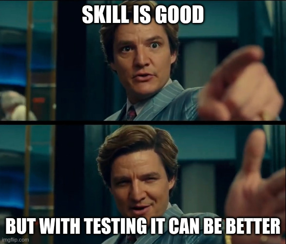

# Short and sweet

## Intro to SKILL testing

---

# Intro, reason & background

---

# Basics

## Anthropic/ Skilljar

https://anthropic.skilljar.com/claude-with-the-anthropic-api?next=%2Fclaude-with-the-anthropic-api%2F287749

Prompt engineering and evaluation

---

# Tool 1

## Agent Skills

https://agentskills.io/skill-creation/evaluating-skills

`evals.json`

<!--

skill-creator plugin installed?

delete select-lunch-location-workspace

Evaluate "select-lunch-location" skill using provided `evals.json`.

-->

---

# Tool 2

## Promptfoo

https://www.promptfoo.dev/

`promptfooconfig.yaml`

<!--

cd eval-X
promptfoo eval
promptfoo view

symlinks don't work?! -- Copy/paste skill into fixture.

-->

---

# Links

* https://github.com/obra/superpowers/blob/main/skills/writing-skills/SKILL.md
* https://agentskills.io/skill-creation/evaluating-skills
* https://www.promptfoo.dev/docs/intro/
* https://github.com/promptfoo/promptfoo/issues/9203
* https://agentevals.io/

---

# Q&A
